<p align="center">
  
</p>

A Ruby tool that compares published gems from RubyGems.org and with source code from repositories like GitHub to verify integrity and detect hidden supply chain attacks.

## How to use it for an entire application

Add this line to your application's Gemfile:

```ruby
gem 'sourcecode_verifier'
```

And then execute:

    $ bundle install

Now you can check all the gems in your project with

    $ bundle exec sourcecode-verifier --bundled

When the command finishes it will write a report to an HTML file and attempt to open that report in your system browser.

## How to use it for a single gem

Install the gem

    $ gem install sourcecode_verifier

```bash
# Verify any gem against its GitHub source
sourcecode-verifier <gem_name> <version>

# Example: verify the base64 gem
sourcecode-verifier base64 0.2.0
```

## Features

- Download gems from RubyGems.org and extract their contents
- Automatically discover GitHub repositories for gems
- Download source code from GitHub using version tags
- Compare gem files with source code files using git diff
- Generate detailed reports showing differences
- **Intelligent cache management** - Warns when using cached content, organized by gem/version

#### Advanced CLI Options

```bash
Usage: sourcecode-verifier [options] <gem_name> <version>

Options:
  -r, --repo REPO          GitHub repository (owner/repo)
  -t, --token TOKEN        GitHub token for private repos
  -c, --cache-dir DIR      Cache directory (default: ./cache)
  -v, --verbose            Verbose output
  -h, --help               Show this help

Examples:
  sourcecode-verifier rails 7.0.0
  sourcecode-verifier --repo myorg/mygem mygem 1.0.0
  sourcecode-verifier --token $GITHUB_TOKEN private_gem 0.1.0
  sourcecode-verifier --verbose --cache-dir /tmp/cache rails 6.1.0
```
#### Exit Codes

- `0`: Files are identical
- `1`: Differences found
- `2`: Error (missing arguments, gem not found, etc.)
- `3`: Interrupted by user (Ctrl+C)
- `4`: Unexpected error

### Ruby API

If you are building this verification into a automated process you can use the Ruby API directly.

#### Basic Verification

```ruby
require 'sourcecode_verifier'

# Verify a gem against its GitHub source
report = SourcecodeVerifier.verify('rails', '7.0.0')

puts report.summary
puts "Identical: #{report.identical?}"
puts "Diff file: #{report.diff_file_path}"
```

#### Advanced Options

```ruby
# Specify a custom GitHub repository
report = SourcecodeVerifier.verify('my_gem', '1.0.0', {
  github_repo: 'myusername/my_gem',
  github_token: 'your_github_token', # Optional, for private repos
  cache_dir: './my_cache',           # Custom cache directory
  verbose: true                      # Enable verbose output
})

# Use local files (optimized flow)
report = SourcecodeVerifier.verify_local('/path/to/gem/files', '/path/to/source/code')
```

### Working with Reports

```ruby
report = SourcecodeVerifier.verify('rails', '7.0.0')

# Check if files are identical
if report.identical?
  puts "✓ Gem and source code match perfectly!"
else
  puts "⚠ Differences found:"

  # Show files only in gem
  puts "Files only in gem: #{report.gem_only_files}"

  # Show files only in source
  puts "Files only in source: #{report.source_only_files}"

  # Show modified files
  puts "Modified files: #{report.modified_files}"

  # Get the detailed diff
  puts File.read(report.diff_file_path)
end

# Save report as JSON
report.save_report('verification_report.json')

# Print formatted summary
report.print_summary
```

## Configuration

### GitHub Token

For private repositories or to avoid rate limiting, set your GitHub token:

```ruby
report = SourcecodeVerifier.verify('private_gem', '1.0.0', {
  github_token: ENV['GITHUB_TOKEN']
})
```

### Custom Repository

If the gem's GitHub repository can't be automatically discovered:

```ruby
report = SourcecodeVerifier.verify('gem_name', '1.0.0', {
  github_repo: 'owner/repository'
})
```

## Adapters

Currently supported source code platforms:

- **GitHub**: Automatically discovers repositories and downloads source code by version tags

## Development

After checking out the repo, run:

```bash
bundle install
```

To run tests:

```bash
bundle exec rspec
```

## Contributing

Bug reports and pull requests are welcome on GitHub at https://github.com/yourusername/sourcecode-verifier.

## License

The gem is available as open source under the terms of the [MIT License](https://opensource.org/licenses/MIT).
